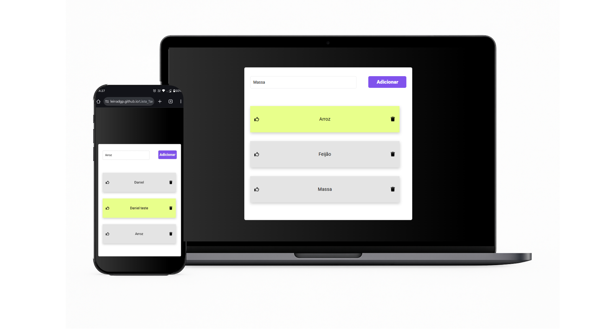

# ✅ Lista de Tarefas | To-Do List

Aplicação de lista de tarefas desenvolvida com React. Permite adicionar, remover e marcar tarefas como concluídas. Utiliza **Styled Components** para estilização e `useState` para gerenciamento de estado.

## 🖼️ Demonstração

## ⚙️ Funcionalidades

- ✅ Adicionar novas tarefas
- 🗑️ Remover tarefas individualmente
- ✔️ Marcar tarefas como concluídas
- 🎨 Estilo dinâmico com mudança de cor conforme o status (concluído ou não)
- 📱 Responsivo: funciona bem em desktop e mobile

## 🛠️ Tecnologias Utilizadas

- React
- JavaScript (ES6+)
- Styled Components
- HTML5 e CSS3 (via styled components)
- Vite (ou Create React App, dependendo de qual usou)
- Git & GitHub

# 🌐 Projeto online
👉 Acesse a [Lista de Tarefas Aqui](https://leinadgp.github.io/Lista_Tarefas/)

# 👨‍💻 Autor
Desenvolvido por [Daniel Guimarães Pedrozo](https://linkedin.com/in/danielguimraespedrozo/)
